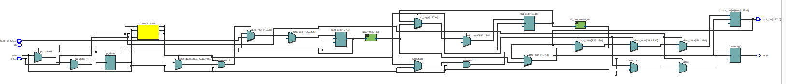
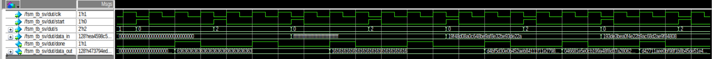
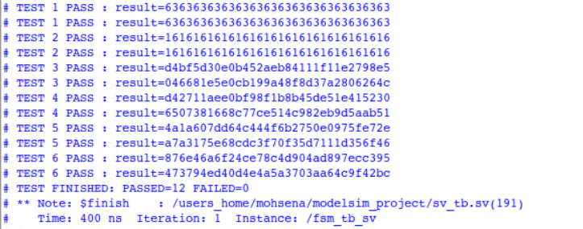
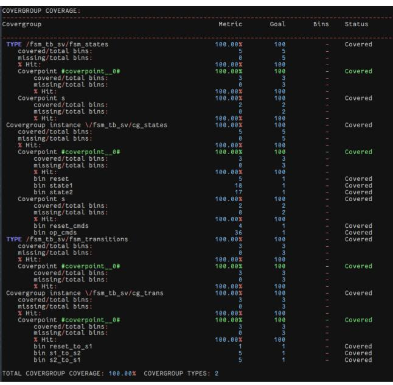
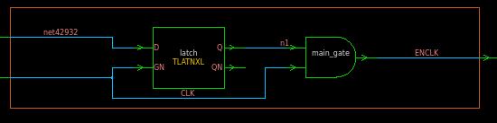

# AES Transformations: RTL Design, Verification, and Clock Gating

## Project Overview

A three-part hardware project covering a 128-bit AES transformation datapath, SystemVerilog verification, and synthesis with clock gating. The datapath supports SubBytes alone or SubBytes followed by MixColumns. It implements these two transformations, not a complete AES cipher.

| Stage | Work included |
| --- | --- |
| Part 1 — RTL design | Verilog datapath, transaction-based FSM, and directed module/controller simulations. |
| Part 2 — Verification | Revised FSM, output checker, assertions, functional coverage, and a saved coverage report. |
| Part 3 — Clock gating | Mapped netlist, clock-gating structure, and synthesis area/power/timing reports. |

Reports: [Part 1 — RTL](docs/reports/part1-rtl-design.pdf) · [Part 2 — Verification](docs/reports/part2-systemverilog-verification.pdf) · [Part 3 — Synthesis](docs/reports/part3-clock-gating-synthesis.pdf).

## Architecture and Main Features

- **SubBytes:** 16 parallel S-box instances substitute the sixteen input bytes.
- **MixColumns:** four columns are transformed using XOR and multiplication by 2 and 3 in GF(2⁸).
- **Control:** `start` captures the input, `s[0]` requests synchronous reset, and `s[1]` selects the transformation mode.
- **Registered output:** `data_out` carries the 128-bit result, with `done` indicating completion according to the selected controller's protocol.
- **Clock gating:** the mapped design contains two latch-and-AND clock-gating structures associated with the input and output register banks.

The controller revisions are preserved separately. Part 1 registers the intermediate SubBytes result, latches the mode for each transaction, and returns to Reset after completion. Part 2 removes the intermediate register and stays in an operating state; mode changes drive transitions between SubBytes and MixColumns. Part 3 supplies the same RTL and SystemVerilog testbench as Part 2, plus the mapped netlist.


*The Part 1 RTL view shows controller logic, datapath blocks, and registers before the Part 2 architectural revision.*

## Verification Methodology

Part 1 contains an FSM testbench and a standalone MixColumns stimulus/monitor test. Part 2 adds a standalone SystemVerilog environment with:

- A transaction-driving task and fixed expected-output comparisons.
- Pass/fail counters for 12 comparisons across six numbered groups; the supplied source uses four distinct input vectors.
- Assertions checking one-cycle `done` behavior and known output bits when `done` is asserted.
- Covergroups for three FSM states, two command categories, and three selected state transitions.


*The archived waveform shows clk, start, s, data_in, done, and data_out during reset and changes between the two transformation modes.*

## Verification Results


*The saved console reports 12 passing output comparisons and zero failures at 400 ns.*

The [Part 2 coverage report](results/part2/coverage_report_fsm.txt) records:

| Metric | Archived result |
| --- | ---: |
| FSM statement coverage | 28/28 — 100% |
| FSM branch coverage | 20/20 — 100% |
| FSM condition coverage | 2/2 — 100% |
| FSM toggle coverage | 1,286/1,308 — 98.31% |
| Defined state/command bins | 5/5 — 100% |
| Defined transition bins | 3/3 — 100% |
| Assertion failures | 0 for both properties |
| Filtered code-coverage total, including testbench | 88.21% |


*Both defined covergroups reached 100%. This covers the selected bins, not every possible input or FSM transition.*

These are preserved results from the submitted project. The saved console uses all-zero and all-one vectors in its first two groups, while the supplied testbench repeats another vector for those groups. Exact reproduction of the archived sequence therefore requires resolving that source/result mismatch. See [verification notes](docs/VERIFICATION_NOTES.md).

## Clock Gating and Synthesis


*The latch holds the enable during the clock's high phase; the AND gate produces the gated clock.*

Part 3 reports the following synthesis comparison at 1.62 V:

| Metric | Original | Clock-gated |
| --- | ---: | ---: |
| Total cell area, library units | 107,140.0193 | 104,282.6417 |
| Dynamic power | 2.0145 mW | 1.9801 mW |
| Cell leakage power | 2.5222 µW | 2.5290 µW |

The reported dynamic-power reduction is approximately 1.7%. These are synthesis estimates. The supplied timing screenshots are minimum-delay/hold reports and do not establish a setup-limited maximum frequency.

## Tools and Repository Structure

Verilog, SystemVerilog assertions and covergroups, ModelSim/Questa, Intel Quartus, and Synopsys Design Compiler/Design Vision. The mapped netlist identifies DC Ultra W-2024.09.

- `rtl/part1/`, `rtl/part2/`: original controller and datapath revisions.
- `tb/part1/`, `tb/part2/`: original Verilog and SystemVerilog tests.
- `netlist/part3/`: synthesized clock-gated implementation.
- `scripts/`: added simulation and netlist-compilation helpers.
- `results/part1/`–`part3/`: original screenshots, coverage text, and display scripts.
- `docs/reports/`, `docs/images/`: three reports and five selected figures.
- `vendor/`: instructions for the external cell-model dependency.

## How to Run

Open ModelSim/Questa in the repository root. Use an edition supporting assertions and covergroups for Part 2, then select a run:

```tcl
do scripts/run_part1_fsm.do
do scripts/run_part1_mixcolumns.do
do scripts/run_part2_sv.do
```

Each helper uses a separate directory under `build/`. The Part 2 helper enables coverage, limits simulation time, checks the output counters, and saves new coverage outputs separately from the archived results. Inspect assertion messages as well as the counters.

For netlist compilation, provide the licensed `slow.v` cell model as explained in [vendor/README.md](vendor/README.md), then run `do scripts/compile_part3_gate.do`. This compiles the netlist; it does not run a gate-level regression. The original SystemVerilog bench references RTL state constants absent from the mapped netlist and needs adaptation for that use.

No HDL simulation or synthesis was rerun while assembling this repository. Original source files are preserved; the added helpers and file mappings are documented in [source provenance](docs/SOURCE_PROVENANCE.md).

## Status and Attribution

The project demonstrates directed verification and coverage measurement. It does not include a complete AES implementation, formal equivalence results, a post-layout flow, or reusable synthesis constraints. Known testbench scheduling and reset-test issues are documented in the verification notes.

Course project by **Omar Wattad and אחמד מוחסן**, as credited in the reports, for **Digital Design and Logic Synthesis (361.1.3611)**. The proprietary Artisan/TSMC cell-model file is an external dependency and is not redistributed in this package.
